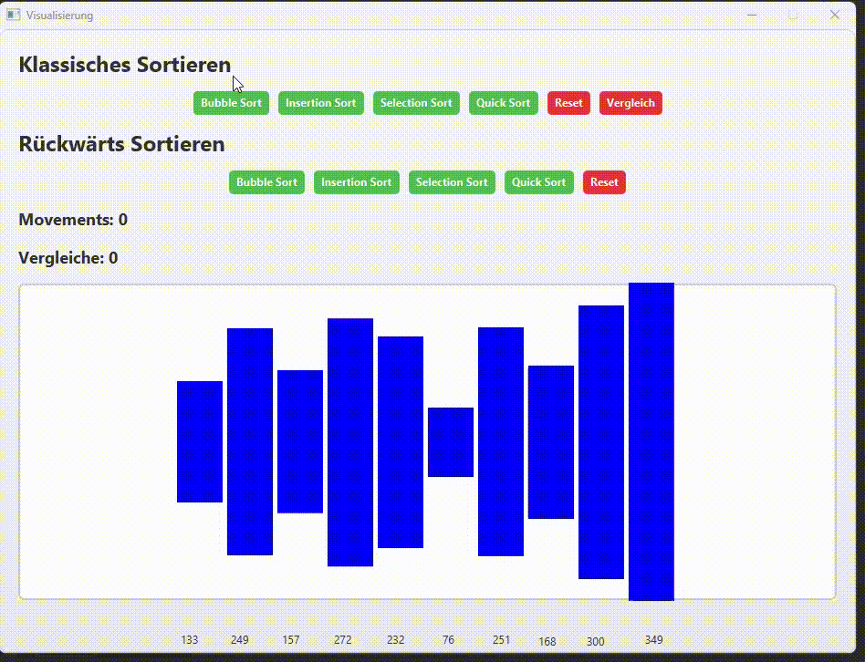

# JavaFX Sorting Algorithm Visualization

## Description

This project is a JavaFX application developed in Eclipse that visualizes various sorting algorithms. The application provides an interactive way to observe the behavior and efficiency of different sorting techniques, including:

- **Bubble Sort**
- **Quick Sort**
- **Selection Sort**
- **Insertion Sort**

## Requirements

Ensure you have the following installed:

- **Java JDK 17 or higher**
- **Eclipse IDE** with JavaFX support (e.g., e(fx)clipse plugin)
- **JavaFX SDK** (if not included in JDK)

## Installation

1. **Clone the repository**

   ```sh
   git clone <repository-url>

## Preview

[](preview.gif)
